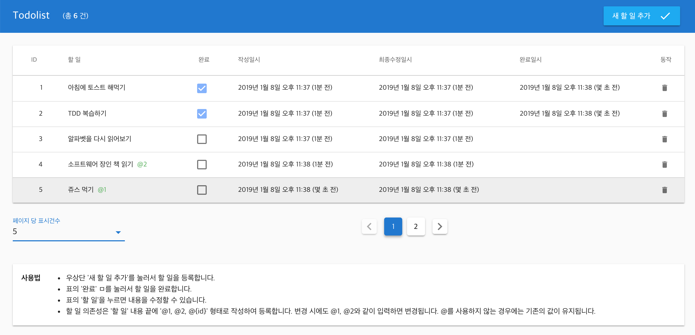

# Example Todolist Kotlin
## Introduction

Example Todolist Kotlin(ETK) is a toolist web service example with Kotlin and Ktor based REST API. Web UI is based on Vue.

**Techstack**
- Frontend: Kotlin, Ktor, HikariCP, Guice, H2, Junit4, Mockito
- Backend: Vue, Vuex, Vuetify, Typscript, Axios, Moment.js

This project show how to design and develop an web service with Ktor and SPA. REST API and the repository is designed with DIP(Dependency Inversion Principle). Vue and Vuex with Vuetify in Typscript. Check commit history!


**Contact to me anytime**

This project is in Korean. But you can ask about this project if you have a question. Leave an issue or mail to me ([@lubang](https://github.com/lubang)). Thanks.

---

Example-todolist-kotlin(이하 ETK)은 Todolist 예제로 Kotlin과 Ktor 기반의 REST API 서버입니다. Web UI는 Vue, Vuex를 이용하여 구현하였습니다.



## 기술 스택
ETK에서 사용한 기술은 다음과 같습니다.

### Backend
#### [Kotlin](https://kotlinlang.org/)
Jetbrain 사에서 만든 개발 언어로 자바와 100% 호환이 가능한 장점이 있습니다. 그리고 간결한 문법과 타입 추론을 제공하여 실용적인 개발을 지원합니다.

```
data class CreateTodoItemRequest(
    val message: String,
    val dependentIds: Set<Long>
)
```
위 코드는 message, dependentIds 라는 프로퍼티(public get, immutable)를 정의하였습니다. 불필요한 코드가 필요하지 않기 때문에 빠른 개발을 할 수 있습니다.

#### [Ktor](https://ktor.io/)
Kotlin 기반의 웹 프레임워크로 모듈 조합을 통한 빠른 개발을 지원하고 코루틴 기반의 비동기 프로그래밍 모델을 제공합니다. [Kotlin Ktor vs Golang performance](https://medium.com/@omkard/kotlin-ktor-vs-golang-performance-eb3c56127373) 글을 참고하면 Golang 성능과 미세한 차이를 보입니다. 개발 편의성과 Java에서 생성된 다수의 라이브러리를 그대로 활용 가능하다는 점을 고려할 때 Kotlin + Ktor 개발 환경이 유용하다고 생각됩니다.

#### [HikariCP](https://github.com/brettwooldridge/HikariCP) + [Exposed](https://github.com/JetBrains/Exposed) + [H2](http://www.h2database.com/)
HikariCP는 Spring framework에서도 채택된 고성능 DB Connection pool 입니다.


Exposed는 Kotlin 기반의 Lightweight SQL library로 JetBrain에서 개발 중인 라이브러리입니다. 다음 코드와 같이 Exposed의 DSL을 기반으로 코드를 작성하도록 도와줍니다.

```
override fun findById(id: Long): TodoItem {
    return transaction {
        TodoItems
            .select { TodoItems.id eq id }
            .limit(1)
            .map { toTodoItem(it) }
            .first()
    }
}
```
H2 데이터베이스는 In-Memoroy DB로 SQL DB 개발 및 테스트 용도로 매우 유용합니다. ETK에서는 Embedded H2를 이용하여 서버가 켜지면 함께 구동됩니다.

#### [Guice](https://github.com/google/guice)
ETK는 강력한 계층 구조로 설계/개발되었습니다. 도메인 및 어플리케이션 계층으로 의존성 주입을 위한 도구로 대중적인 Guice를 선택하였고 Persistence를 제공하는 Repository와 Web service를 제공하는 Ktor의 의존성을 주입하였습니다.

#### [Junit4](https://junit.org/junit4/) + [Mockito](https://github.com/nhaarman/mockito-kotlin)
TDD(Test driven development) 기반의 개발을 수행하기 위해 Test runner로 JUnit4, 그리고 인터페이스 Mocking을 위한 라이브러리로 mockito-kotlin을 사용하였습니다.

Test 코드는 함수명 자체에서 테스트 목적을 명확히 하기 위해서 상세하게 서술하였고 AAA Pattern(Arrange, Act, Assert)를 명시하여 테스트를 읽는 개발자에게 도움이 되도록 하였습니다.
```
@Test
fun `edit a message should change a modified time`() {
    // Arrange
    val todoItem = TodoItem.create("Wake up 8:00 to climb a rock")

    // Act
    todoItem.editMessage("Wake up 9:00 to go swim!")

    // Assert
    assertEquals("Wake up 9:00 to go swim!", todoItem.message)
    assertNotNull(todoItem.modifiedAt)
}
```

### Frontend
#### [Vue](https://vuejs.org/)
Vue는 강력한 CLI와 잘 구성된 Code structure를 기본적으로 제공합니다. 빠른 개발을 위해 Vue를 선택하였습니다.

#### [Vuex](https://vuex.vuejs.org/)
Vuex는 Action -> Mutations -> State -> Display 순으로 화면을 갱신하도록 제공하는 라이브러리입니다. React의 Redux와 동일한 패턴으로 Backend에서는 많이 활용되었던 CQRS + Event sourcing과 유사한 형태를 보여주기 때문에 활용하였습니다. 이러한 특정을 기반으로 특정 컴포넌트에서 발생한 이벤트로 다수의 컴포넌트들이 갱신되는 화면을 쉽게 구현 가능합니다. Frontend 개발 시에는 Javascript 특유의 Callback 중첩 현상(콜백지옥)이 생기지 않도록 async와 await을 적극적으로 활용하였습니다.

#### [Vuetify](https://vuetifyjs.com)
Vue를 기반으로 구성된 UI 라이브러리로 다양한 컴포넌트를 제공하여 쉽게 Material design을 구현할 수 있도록 도와줍니다.

## Todolist 아키텍처
Todolist는 DDD(Domain driven development) 관점으로 개발하였습니다. 추후 다른 프레임워크 및 구현체(예. Spring framework)로 기술로 변경하더라도 port.adapter의 구현체만 다시 작성하면 도메인과 어플리케이션은 변화가 없도록 설계하였습니다.

### Domain
TodoItem(할 일 항목), Dependency(할 일 의존성)을 도출하였고 ID는 DB의 Auto incremental을 통해 발급되도록 정의하였습니다.

### Serialization
Gson을 이용한 Json serialization을 이용하였습니다. Jackson이 Spring을 비롯하여 많은 곳에서 사용되지만 Gson은 Bean 형태가 아니더라도 Serialization을 제공하기 때문에 선호하는 라이브러리입니다.

### Persistence
H2를 이용한 DB 저장 기능을 제공하고 이를 위해서 Exposed를 활용하여 개발하였습니다. TodoItem과 Dependency의 Constraint 관계를 Cascade로 설정하여 TodoItem 삭제 시 할 일 의존성도 삭제되도록 구현하였습니다. 이러한 설정들은 코드 기반으로 Exposed를 이용하여 다음과 같이 정의하였습니다.

```
object TodoItems : Table() {
    val id = long("id").autoIncrement().primaryKey()
    val message = varchar("message", 250)
    val completed = bool("completed")
    val writtenAt = datetime("writtenAt")
    val modifiedAt = datetime("modifiedAt")
    val completedAt = datetime("completedAt").nullable()
}

object Dependencies : Table() {
    val todoItemId = long("todoItemId")
        .references(TodoItems.id, ReferenceOption.CASCADE)
        .index()
    val dependentId = long("dependentId")
        .references(TodoItems.id, ReferenceOption.CASCADE)
        .index()
}
```

> Exposed는 현재 0.11.2 버전으로 아직 초기 개발 중인 라이브러리이지만 Todolist를 개발하는데는 충분하기 때문에 사용하였습니다.

### Web service (REST API)
Ktor을 기반으로 Web server를 제공합니다. REST API는 `port.adapter.web.api` 패키지 아래의 RouteApi 클래스를 추가하여 확장 가능합니다. RouteApi 클래스는 Guice를 이용해 생성자에서 주입받은 서비스 인스턴스를 활용하여 동작합니다. 강력한 계층 구조를 유지하기 위해서 Web Service에서 사용하는 JSON 개체를 서비스로 전달하지 않고 서비스 함수와 파라미터 값을 전달하도록 구현하였습니다.

만약 REST API외에도 다수의 인터페이스가 추가되어야 한다면 일관성 있는 어플리케이션 계층 요청을 위한 Command/Query model 객체를 만들어 접근하도록 설계(CQRS 형태)할 예정입니다.

## Todolist 프로젝트 개발 및 배포 방법

### 개발 방법
Backend 개발은 IntelliJ IDEA CE 기반으로 구성하였습니다. IntelliJ IDEA CE에서 main 함수를 실행하여 개발 모드를 시작합니다.
```
$ com.github.lubang.example.todolist.Main Debug 모드로 시작
```

Frontend 개발 시작
```
$ cd src/web
$ yarn // Node 패키지 설치
$ yarn serve // 8081 포트로 개발 서버 수행
```
Backend, Frontend 를 실행하면 8080, 8081 포트로 각각 실행됩니다. Frontend는 실제 배포 시 Backend의 Static resource로 배포되기 때문에 Backend에는 별도의 CORS를 설정하지 않습니다. 하지만 개발 모드에서는 8080(Backend), 8081(Frontend)로 주소가 다르기 때문에 CORS 충돌이 발생합니다. 이러한 현상을 제거하기 위해서 Webpack의 devServer proxy를 이용하여 개발을 합니다.

개발 환경 포트
- Backend: 8080
- Frontend: 8081 (/api 는 Proxy를 통해서 http://localhost:8080/api로 매핑)

### 배포 버전
Todolist는 Github Release에 배포된 [example-todolist-kotlin-1.0-SNAPSHOT-all.jar](https://github.com/lubang/example-todolist-kotlin/releases/download/v1.0-SNAPSHOT/example-todolist-kotlin-1.0-SNAPSHOT-all.jar) 를 다운 받아서 사용 가능합니다. 패키징 관련 설정은 [Commit cb9a230](https://github.com/lubang/example-todolist-kotlin/commit/cb9a230b85634829a1824c489dcd899f926c20e0)을 참고해주세요.

```
$ curl -O https://github.com/lubang/example-todolist-kotlin/releases/download/v1.0-SNAPSHOT/example-todolist-kotlin-1.0-SNAPSHOT-all.jar
$ java -jar example-todolist-kotlin-1.0-SNAPSHOT-all.jar
// http://locahost:8080 접속
```
운영 환경 포트 (기본값)
- ETK Port 8080

## ETK Metrics
- 개발자: lubang (https://github.com/lubang/example-todolist-kotlin)
- 개발기간: 2019-01-03 ~ 09
- 개발도구
  * IntelliJ IDEA CE
  * Visual studio code
  * openjdk 1.8 (zulu)
  * node v11.6

### 개발 후기
Kotlin + Ktor 기반의 REST API 서버와 SPA(vue 기반)를 통합적으로 활용한 서비스 예제입니다. 주요한 개발 컨셉은 Domain과 port/adapter의 분리, 그리고 Ktor를 이용한 REST API 개발을 활용하는 것입니다. 위 목적에 따라 적절히 조합을 한 프로젝트입니다. 관련된 문의는 언제든지 메일, 이슈로 남겨주시면 확인하는데로 답변하겠습니다. 감사합니다. :)
